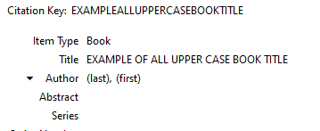
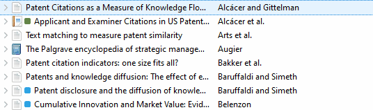
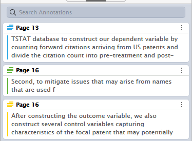
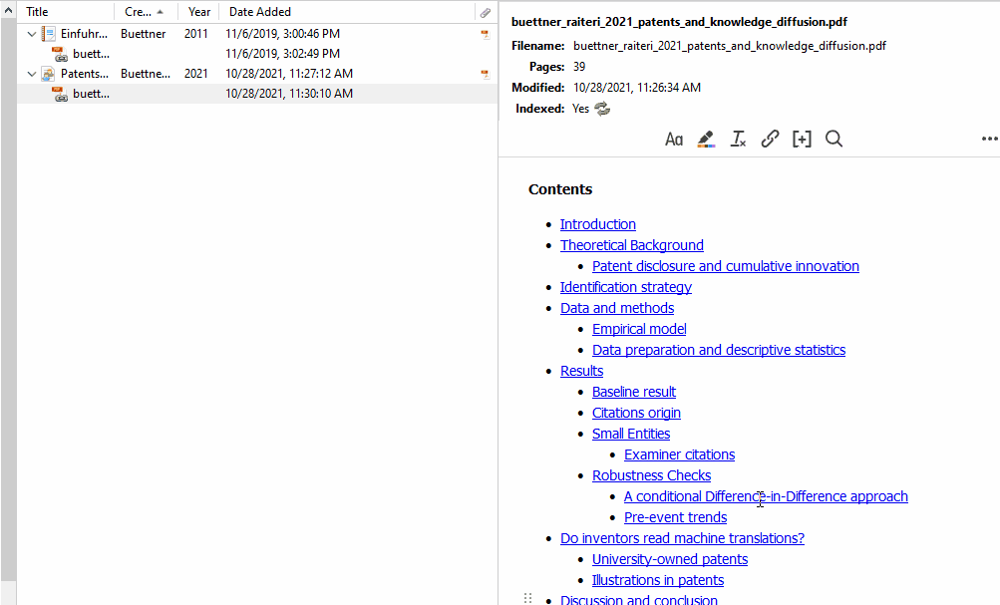

# Small QoL improvements

The following page provides a collection of useful functions and Quality of Life improvements.

## Case Converter
Right-click on the 'Title' field on the right side after selecting an item to convert it to 'Title Case', 'Sentence Case', or 'BBT sentence case'.

## Colaboration & Zotero Groups
Zotero Groups is a handy feature that allows you to work on collaborative projects. I don’t use this feature, but you can find more information on the official [Zotero website](https://www.zotero.org/groups/).

## Expand all items
When viewing the library, use the '+' and '-' keys next to the numpad to expand or collapse all items in your collection.

## Find the collection of an item
Looking at an item in your library and wondering whether you already categorized it? You can highlight all collections that contain this item by holding down the 'Control' key on Windows, the 'Option' key on Mac OS X, or the 'Alt' key on Linux.

## Full-Text Cache
The [website](https://www.zotero.org/support/preferences/search) describes Full-Text cache as follows: Zotero creates an index to allow the full text contents of PDF and plain-text attachments in your library to be searched with Quick Search (“Everything” option) and Advanced Search (via “Attachment Content”).

You can change the maximum limit of characters and pages to be indexed in 'Preferences - Search - Full-Text Cache'. If indexing runs into problems, you can also rebuild the index or deactivate it altogether ('Clear Index' and 'Maximum characters to index per file' set to 0).

## Highlighting text & extracting annotations
In version 6, Zotero introduced a new in-app PDF reader. From within Zotero, you can read the document, highlight text in different colors, add notes and select a whole area. To do so, use the buttons on the top of the page 

The annotations appear on the left side, where you can add tags or comments.

To extract the annotated text, go back to the main view, right-click the PDF file and select 'Add Note from Annotations'. A newly created note will be created containing the annotations of the pdf file.

If you don't want to use the built-in PDF reader, you can use the plugin ZotFile to extract annotations from PDFs.

## Profiles
ou can use [multiple profiles](https://www.zotero.org/support/kb/multiple_profiles) to keep your libraries separated. You can also maintain separate libraries within a single profile using [Zotero Groups](https://www.zotero.org/support/groups).

## Today, tomorrow and yesterday
The date fields will automatically convert 'yesterday', 'today', and 'tomorrow' into the respective dates

## Wildcards when Searching
You can use the % sign as a wild card to substitute characters when using the search within Zotero. 
