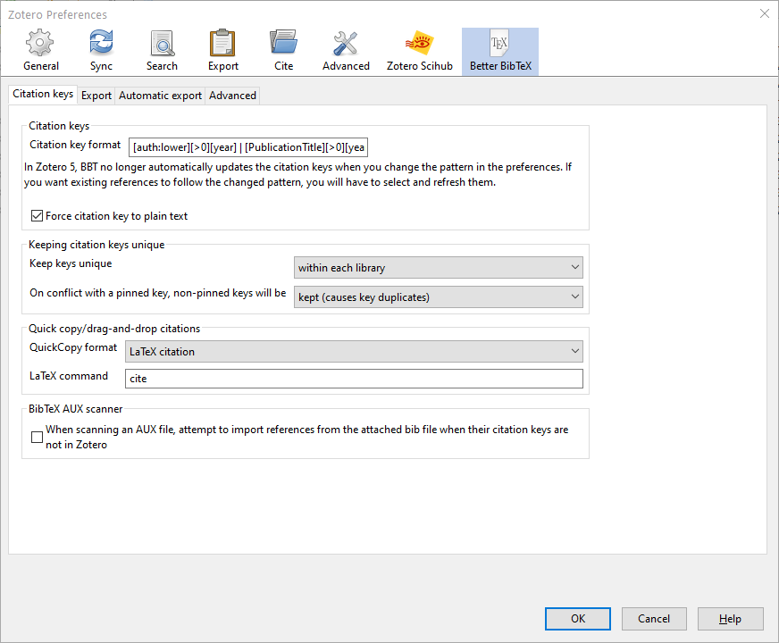
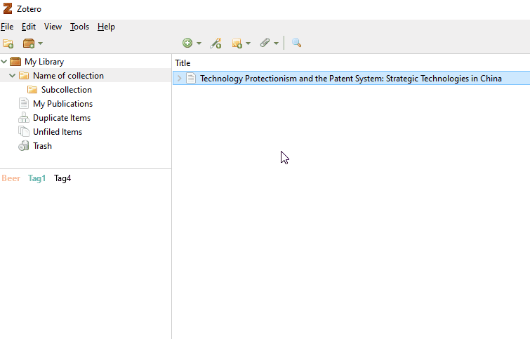
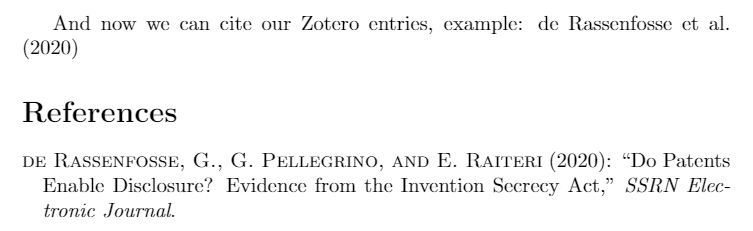
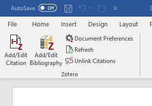
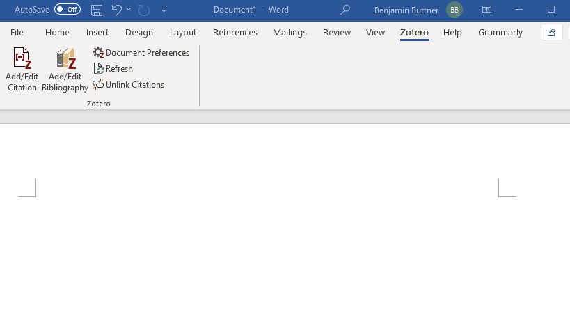
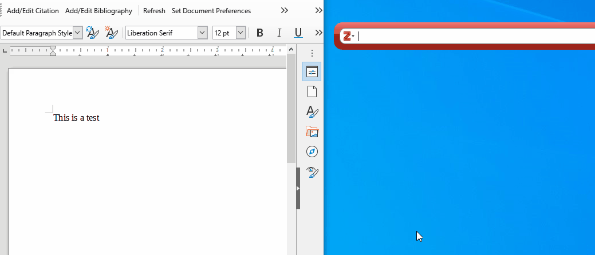

---
hide:
  - toc
---

Zotero offers a vast variety of different citation styles. You can choose your preferred one under  
`Edit - Preferences - Export`

Afterward it is possible to export entries by right-clicking `Create Bibliography from item...`.  
However, most people use Zotero in combination with a Word processing Software. In the following, I will describe a convenient way to use Zotero with Latex, MS Word or LibreOffice.


=== "Latex"

    To use Zotero together with Latex, I highly recommend installing the Plugin Better BibTex first. The Plugin offers many improvements and custimization options. It will e.g., automatically create a custom Citation Key for each entry of your Zotero Database. To install the Plugin:

    1. Visit the [official website](https://github.com/retorquere/zotero-better-bibtex/releases) and download the Plugin (if you use Firefox, you will need to right-click on Download and choose Save Link as…)
    2. Install the downloaded .xpi file & restart Zotero ([Short video explanation](images/zotero_bib.gif))  
    `Tools – Addons – Gear Wheel – Install Addon from File`


    ## Better BibTex Preferences
    After the installation, you find a new tab under Preferences.
    `Edit - Preferences - Better BibTex`

    

    The Plugin allows you to make many adjustments and customize most aspects. Since most options are self-explanatory, up to personal preference, and very well documented on the [official website](https://retorque.re/zotero-better-bibtex/), I will only discuss the option in which I deviate from the default settings.

    `Edit - Preferences - Better BibTex - Citation keys - Citation key format`

    This option dictates the composition of the Citation key. The default value includes the short title of the article, which makes things rather messy.
    I prefer shorter keys, using only the author's last name and publication year. 

    `[auth:lower][>0][year] | [PublicationTitle][>0][year] | [title][year]`

    If the last name is missing, BibTex will use the first name. If both names are missing, the short title of the article will be used.

    ## Exporting Bibliography
    To export the bibliography (.bib file), you can right-click on single entries, collections or multiple entries, and choose `Export Item/Collection`. In the new Export window, choose `Better BibTex` and pick the needed Translator Options.

    

    ## Within Latex

    Now you can easily refer to the .bib file in Latex as usual.

    === "Latex Code"
        ```Latex
        \documentclass{article}
        \usepackage[utf8]{inputenc}
        \usepackage[authoryear]{natbib}
        \bibliographystyle{ecta}

        \begin{document}

        And now we can cite our Zotero entries, example: \cite{derassenfosse2020}

        \bibliography{the\_from\_zotero\_exported\_bib\_file}
        \end{document}

        ```

    === "Renders to"
        

   


=== "MS Word"  
    The word processor plugins for Microsoft Word are bundled with the base installation of Zotero and should be installed automatically for each word processor when you first start Zotero. The plugin will allow you to insert citations as you write.

    If the plugin wasn't installed automatically, you can reinstall it under  
    `Edit - Preferences - Cite - Word Processors` (close Word before starting the installation)

    To (re)activate the Plugin:  
    `Tools - Add-ons - Zotero Word for Windows Integration - Enable`

    ### Within MS Word
    The Plugin adds an additional tab in MS Word.

      

      
    Add a new citation or edit an existing citation in your document at the cursor location.

      
    Insert a bibliography at the cursor location or edit an existing bibliography.  
  
      
    Open the Document Preferences window, e.g. to change the citation style.

      
    Refresh all citations and the bibliography, updating any item metadata that has changed in your Zotero library.

      
    Unlink Zotero citations in the document by removing the field codes. It prevents any further automatic updates of the citations and bibliographies.

    !!! info
        Removing field codes is irreversible and should usually only be done in a final copy of your document. 	


    ### Adding citations to a Word document
    While writing your document, when you get to a point where you want to add a citation, click on the insert citation button in the toolbar and search for the needed citation in the citation dialog. Select your citation from the options shown, then hit enter. If you would like to insert multiple citations, continue typing after selecting the first reference.

    

    If you want to add details to a citation, such as a comment before or after, or a page number, click on the reference in the citation dialog to open a pop-up window that allows you to enter additional information.

    By clicking on the Z in the citation dialog, the option to look at the *Classic View* will appear. This opens a window that gives you access to all of your directories and saved citations in your folder. You can also add comments and page numbers in this window, as well as selecting multiple references to be combined into one citation. If you prefer this view, you can set it as the default under `Preferences - Cite - Word Processors - Use classic Add Citation dialog`.


=== "LibreOffice"
    The word processor plugins for LibreOffice are bundled with Zotero and should be installed automatically for each word processor when you first start Zotero. The plugin will allow you to insert citations as you write.

    If the plugin wasn't installed automatically, you can reinstall it under  
    `Edit - Preferences - Cite - Word Processors` (close LibreOffice before starting the installation)  
    To (re)activate the Plugin:  
    `Tools - Add-ons - Zotero LibreOffice Integration - Enable`


    ### Within LibreOffice
    The Plugin adds a new tab in LibreOffice. The LibreOffice Plugin, other than the Latex and MS Word Plugins, needs [Java Runtime Environment](https://java.com/en/download/) installed to work. 

    

    **Add/Edit Citation**  
    Add a new citation or edit an existing citation in your document at the cursor location.

    **Add/Edit Bibliography**  
    Insert a bibliography at the cursor location or edit an existing bibliography.

    **Refresh**  
    Refresh all citations and the bibliography, updating any item metadata that has changed in your Zotero library.

    **Set Document Preferences**  
    Open the Document Preferences window, e.g. to change the citation style.

    **Unlink Citations**  
    Unlink Zotero citations in the document by removing the field codes. It prevents any further automatic updates of the citations and bibliographies.

    !!! info
        Removing field codes is irreversible and should usually only be done in a final copy of your document. 	


    ### Adding citations to a LibreOffice documents
    While writing your document, when you get to a point where you want to add a citation, click on the insert citation button in the toolbar and search for the citation in your collection in the citation dialog. Select your citation from the options shown, then hit enter. If you would like to insert multiple citations, continue typing after selecting the first reference.

    

    If you want to add details to a citation, such as a comment before or after or a page number, click on the reference in the citation dialog to open a pop-up that allows you to enter the information.

    By clicking on the Z in the citation dialog, the option to look at the *Classic View* will appear. This opens a window that gives you access to all of your directories and saved citations in your folder. You can also add comments and page numbers in this window, as well as selecting multiple references to be combined into one citation. If you prefer this view, you can set it as the default under `Preferences - Cite - Word Processors - Use classic Add Citation dialog`.
