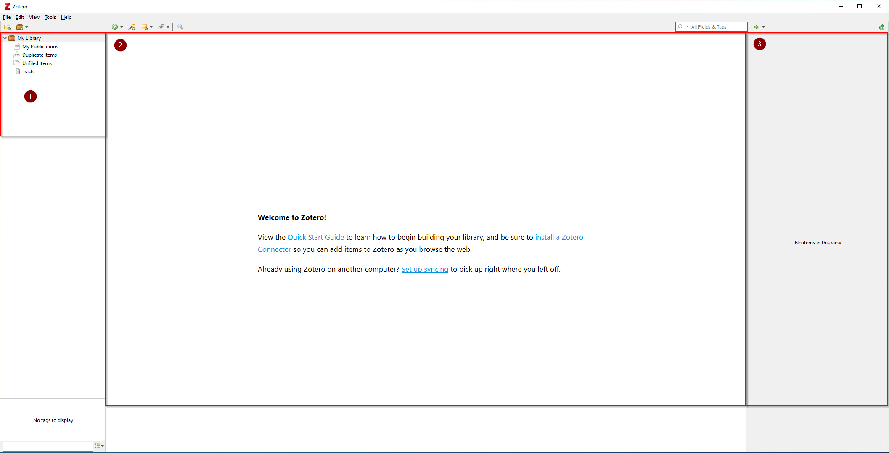
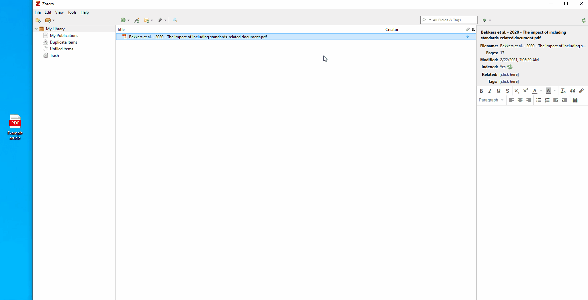
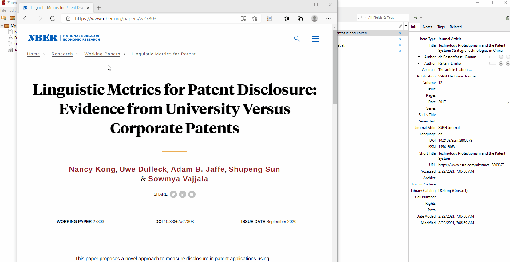
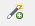

## Let’s get ready to Zotero

Zotero 6.0 for Windows, Linux, and Mac as well as a valuable add-on for your browser, called Zotero-Connector (we talk about the add-on later), are available on the [website](https://www.zotero.org/download/). After downloading Zotero 6.0, follow the installation procedure as usual.

After starting Zotero you will see the following program window. The program is basically devided into three areas (left, middle, right). 

 

1. Collections (and subcollections) are helpful to not get lost in the sea of documents you gathered. You can create a collection for each article you write, projects you work on, or by topic. It is up to you. Learn [How to create Collections.](images/01collection.gif)
2. If you click on a collection, you see all its articles in the middle. By default they are sorted by title. You can change the sorting order by clicking on the different column names. Additionally, you can add additional and/or custom columns - as demonstrated [in the short video.](images/02columns.gif)
3. On the right side you can find information and metadata about the selected article.

!!! info "**Zotero Items**"
    Zotero organizes documents as Items. Each item stores metadata of the added document, such as author, title, and year. You can add multiple attachments to each item, such as PDFs, Word documents or notes and screenshots. 

## Adding your first article…

I know we were all anticipating this moment: it is finally time to add the first article. There are multiple ways to do so.

1.	**Adding a document (e.g. PDFs) manually**  
 My preferred way is to add the document/PDF directly. If you downloaded a document, just drag and drop the file into Zotero. It will automatically create an entry item and add all the necessary information.
     * If information is missing or incorrect you can manually make adjustments on the right side.
     * If Zotero doesn’t create an entry from the PDF, you can right-click on the file and choose *Retrieve Metadata for PDF*

  

2.	**Importing via the browser**  
 Use a browser addon to import articles with your browser
     * Install Zotero Connector for your browser of choice ([available on the website](https://www.zotero.org/download/))
     * When using article databases, library catalogs, web search engines, and other resources, different icons will appear in the menu bar of your browser. The article, book, or page icons in the address bar indicate that you are viewing a single item, and clicking on the icon will import the information into your library. In many cases it also automatically downloads the article.
     * You can add webpages without articles in the same way. Zotero even takea a screenshot of the webpage. 

  

3.	**Adding literature manually**  
 Importing citations into your Zotero collections does not always work without hick-ups. If no icon appears in the address bar or the information is not imported correctly, you may want to use another option.  
   Use this option to add an item manually. Select the item type from the drop-down menu and enter the item's bibliographic information in the item details panel.  
   If you already know the ISBN, Digital Object Identifier (DOI), or PubMed ID of the item, enter it using this option.

4.	**Other**  
 To import libraries from other reference management tools into Zotero (like BibTex, RIS, RDF), start by exporting the bibliographic data from your other software program. In Zotero, you will find the Import option under File in the menu bar.  Browse to your file, select it, and click the “Open” button.
