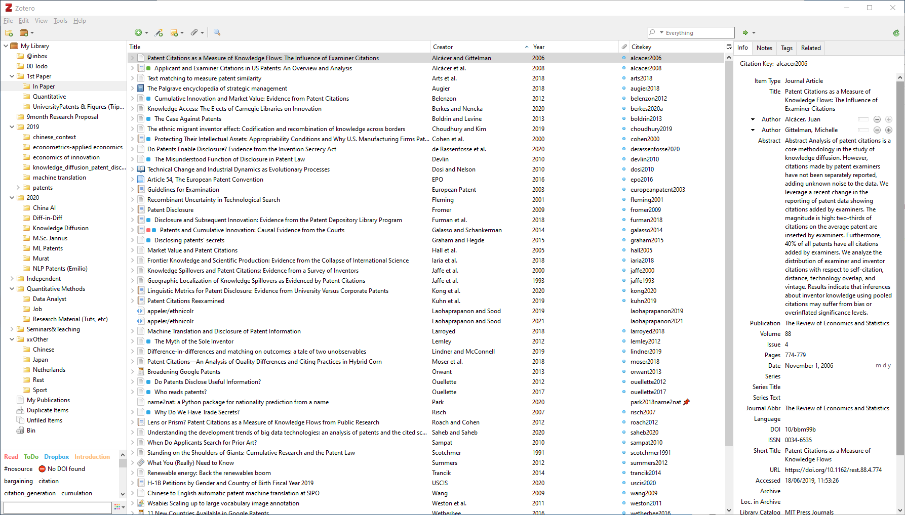

*Excuse me, do you have a moment to talk about Zotero?*

# Zoter-what?

Zotero is an open-source bibliography and citation manager. It makes collecting, storing and organizing literature easier, supports exporting citations to Latex or Word, and offers many more handy features.

The following text demonstrates how to use Zotero (more precisely, how **_I_** use it) and introduces some useful tweaks and plugins to improve quality of life. Do not get discouraged by the wall of text. After getting the hang of it, Zotero saves time and will make your (research) life more manageable.

## To Zotero or not to Zotero, that is the question
If you are doing a Ph.D. or other research-related work, you have probably already asked yourself how to organize all necessary literature. There are many different tools out there. They all have one thing in common: all have advantages and disadvantages, making it impossible to provide the perfect tool for everyone. In the end, it boils down to personal preferences.

The reasons I settled with Zotero are:

- [x]	Open source

    Zotero is fully open source and benefits from all its advantages: transparency, community contributions, and if the team ever abandons the project, new developers could step in (of course, you can contribute as well).

- [x]	Free & non-profit
  
    Zotero is free. You can buy additional online storage, though it is neither mandatory nor necessary. I will explain how to host everything locally or in your own cloud. 

- [x]	Popular & a big community
  
    Many handy plugins exist, and the community is very active and helpful.

- [x]   Availability

    Available for most systems: use it on Mac, Windows, Linux and partly on your phone.

- [x]	Excellent citation style support

    Zotero supports almost any citation style needed. If your specific style is missing, you can (most of the time) easily create it yourself by changing an existing one.

Now that I have your attion let's talk about Zotero. 
