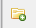
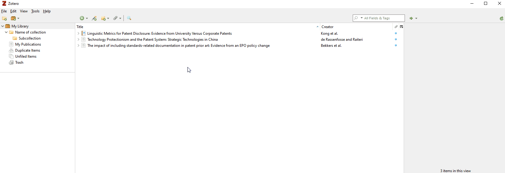
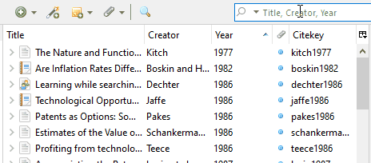
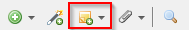
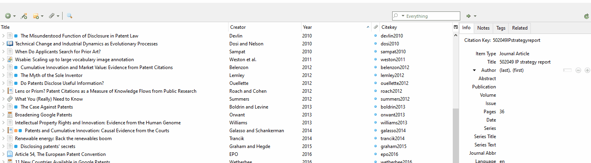

**Collections**  
You always see all articles by clicking on *My Library*. As mentioned before, click on  the collection button to create collections and subcollections ([How to create Collections.](images/01collection.gif)). To add items to collections, you need to drag and drop them. When deleting an item in a collection, the item will be removed from the collection but not from Zotero.  
To entirely delete the item from Zotero you have to right-click, and select *Move item to bin*, while being in *My library*.

**Tags**  
In addition to collections, a handy feature for organizing your Library are Tags. To add Tags, you have to select an item, and switch to the *Tags* tab in the right window. You can add as many tags as needed. The created tags are shown in the lower-left corner.

By right-clicking tags in the lower left corner, you can assign colors to specific tags. In that way, you can quickly highlight critical topics (or papers you have to read). 

If you click on one or multiple tags in the left lower corner, all articles using the tags are selected (only items in the current collection). To get all items, click on *My Library* first.  
By default, tags are automatically created if you import an item using your browser addon. If you don’t like this feature, disable it in the settings:  
`Tools – Preferences – General – Miscellaneous – ‘Automatically tag items with keywords and subject headings’`

**Search**  
Zotero provides a quick search (right upper corner), to search within the Title, in all fields or everywhere. In addition, you can use a more precise search, accessible under ‘Edit – Advanced Search‘.

**Notes**  
To create a note attached to an item, select the item from the list in the center window and either click the *New Note* button at the top and select *Add Child Note*, or go to the *Notes* tab in the right window and click the *Add* button.

A note will be created as an attachment to the item (and also show up under the *Notes* tab). Additionally, a note editor will appear on the right-hand side. You can open a seperate window for the editor by clicking the *Edit in a separate window* button at the bottom of the editor. Text in notes is saved as you type.

Zotero will sometimes automatically import information from a resource, such as the table of contents or abstract, into the notes of an item. If you don't want these notes, use the editor to change or delete these entries - you can also delete the entire note by selecting and deleting it.

A second Note type is *Standalone Notes*. Standalone notes are not directly related to any item in your library (they don't belong to an entry) and will appear in the list of items in your library. To create a standalone note, click the *New Note* button and select *New Standalone Note*.

**Relations**  
Your articles and entries can also have relationships (isn't that nice?). On the right side, switch to the *Related* tab. Here you can choose other articles related to the entry you selected.  
(If you are you on your mobile phone and don't see the following .gif, switch to desktop view)

This feature helps you quickly link important articles to a network and, again, not lose the overview of your entries.
