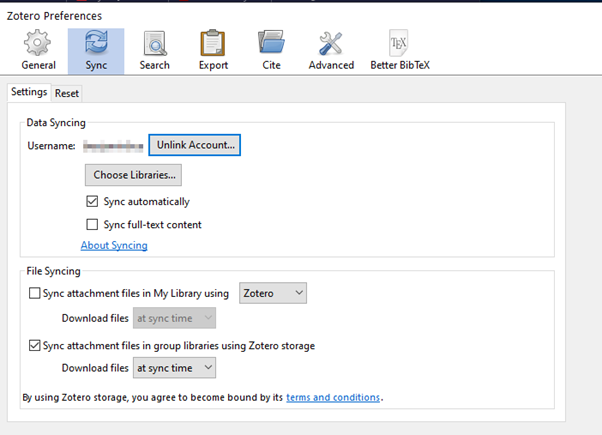
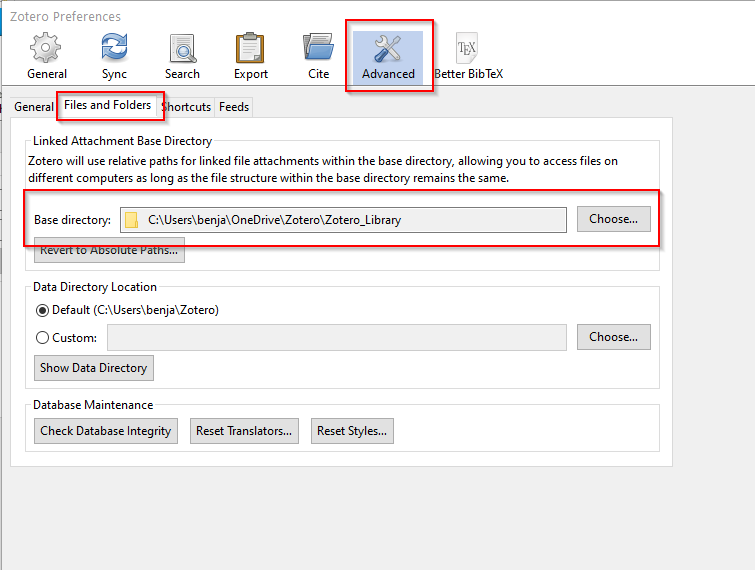

Before we dig deeper, we should address one key functionality of Zotero. The program allows multiple devices to sync your collections, articles, preferences, and data. It does so by uploading the data to Zotero servers (if you enable the option).

However, even though I feel comfortable storing the metadata externally, I don’t like to store the documents themselves on Zotero servers (not so much a matter of distrust, but practicability; privacy; and I already have my own cloud).

In the following steps, I will explain how you can store the information about your collection online while keeping the documents offline (or at your preferred destination).

{align=right width=400}

1. Open the Sync tab under preferences  
`Edit - Preferences - Sync`

2. Create a free Zotero account & link it with your program

The basic account is free and offers 300 Mb of storage space. There are cheap premium accounts available (https://www.zotero.org/settings/storage) if you prefer to host everything on their servers. If you follow my instructions and don’t upload the documents directly, 300 Mb are more than sufficient.

3. After connecting your account, deactivate the synchronization of attachments.

{align=right width=400}

1. Change to the Advanced Tab, and in the Advanced Tab to *Files and Folders*  
`Edit - Preferences - Advanced Tab - Files and Folders`

Change the **Links Attachment Base Directory** to the directory of your preference. You can also point it to a directory on your cloud service of choice, so that the documents are available on multiple devices (in the example picture, I store them on OneDrive). If you store the documents in a cloud, be aware that you maybe share sensitive data with the cloud provider.

!!! warning
    Don’t save the Data Directory on a cloud server/folder. It will break Zotero eventually.
    Keep the Data Directory locally and backup it from time to time if necessary!

Almost done, hang in there! Maybe get a cup of coffee. Let’s make a couple of additional changes in the next chapter to make our life easier.