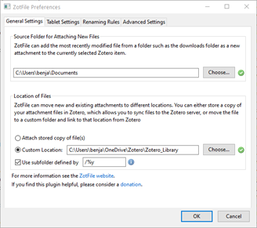

Zotero has a great community, actively developing Addons that add plenty of improvements. You can find a list of Plugins on the [official website](https://www.zotero.org/support/plugins).

An essential add-on that helps organize and store documents is *ZotFile*, maintained by Joscha Legewie.

1. Visit the [official website](http://zotfile.com/) and download the Plugin (if you use Firefox, you will need to right-click on Download and choose Save Link as…)
2. Install the downloaded .xpi file & restart Zotero ([Short video explanation](images/05azotfile.gif))  
`Tools – Addons – Gear Wheel – Install Addon from File`

## ZotFile
Open the preferences of ZotFile  
`Tools – ZotFile Preferences…`

### General Settings
{ align=left width="300"}

**Source Folder for Attaching New Files**  
If you want to watch a folder and add the content automatically (I rarely use this feature, though)

**Location of Files**  
 Change to Custom Location and use **the same path** as for Links Attachment Base Directory! ([changed in previous chapter](syncing/))

If you want to organize the documents in the directory, you can tick the *Use subfolder defined by box*. In my case, `/%y` creates subfolders by year.

### Renaming Rules

{ align=right width="300"}
In this tab, you can specify how to rename your documents on your hard disc. So that they are conveniently named outside of Zotero.

My preference is to use subfolders to organize the documents by year and rename the document to AUTHOR NAME_YEAR_TITLE.

To do so, you need to change **Format for all Item Types except Patents** to `{%a_}{%y_}{%t}`.

Resulting in the following structure outside of Zotero:

### Workflow
To wrap up, the workflow is now as follows:  
Add a document to Zotero - The document will automatically be moved to your destination folder, sorted by year, and renamed.
Additionally, an entry in Zotero is created, which links to the document.

If everything works correctly, you should see a chain next to the document, which indicates that the document was moved to the destination folder. If Zotero doesn't do it automatically, you can right-click on the document and choose ``Manage Attachments -- Rename Attachments``.

{align=left}

Here you can see that the first entry is not linked correctly. After running ``Manage Attachments -- Rename Attachments``, the document was moved and now shows the correct chain symbol.

Afterward, you can delete the original document from your download folder (or whereever you initially saved it).

??? note "Click here if you want to learn even more about linked attachments"

    Stored files are the default and are stored within the Zotero data directory. If you add a stored file from a file on your computer, the file is copied to the Zotero data directory. Zotero will automatically manage them, including deleting them if you delete the attachment item in Zotero. If you use file syncing, Zotero will automatically sync stored files between devices and make them available in your online library on zotero.org. However, that can quickly fill up your online storage therefore, I introduced the alternative storage on your own cloud/server.

    With linked files, Zotero only stores a link to the original file's location on your computer. Linked files were not introduced by Zotero itself, but by the previously installed Plugin ZotFile. The advantage is the previously discussed possibility of using your own server, renaming rules, etc. The downside is, however, that you have to manually delete files outside of Zotero. If you ever want to delete a document you have to delete it in Zotero AND in the destination folder.

### Other Plugins

As mentioned previously, Zotero has a big community and offers multiple Plugins to improve its functionality. Please check the [official website](https://www.zotero.org/support/plugins) for an overview of Plugins. Since it highly depends on your personal preference, I will not give detailed explanations about the other Plugins. Please feel free to contact me if you have any questions.

!!! warning
    Make sure that the Plugin you want to use is compatible with your version of Zotero!

### Plugins I use  

[ZotFile](http://zotfile.com/)  
A Zotero plugin to manage your attachments (described above).

[Better BibTex](https://retorque.re/zotero-better-bibtex/)  
A Plugin for better Latex support ([already discussed in a previous chapter](/adding-citations.md)) Test

[zotero-auto-index](https://github.com/retorquere/zotero-auto-index#readme)  
Automatically keeps your attachments indexed.

[zotero-date-from-last-modified](https://github.com/retorquere/zotero-date-from-last-modified)  
If the date field is not filled, and the URL field is, fill the date from URL last-modified automatically after an item changes.

[Zotero DOI Manager](https://github.com/bwiernik/zotero-shortdoi)  
The add-on can auto-fetch DOI names for journal articles using the CrossRef API, as well as look up shortDOI.

[Zotero Scholar Citations](https://github.com/beloglazov/zotero-scholar-citations)  
The add-on automatically fetches the numbers of citations of your Zotero items from Google Scholar and makes it possible to sort your items by the citations.

[Zotero Storage Scanner](https://github.com/retorquere/zotero-storage-scanner#readme)  
A Zotero plugin to remove the broken & duplicate attachment link of the bibliography.
