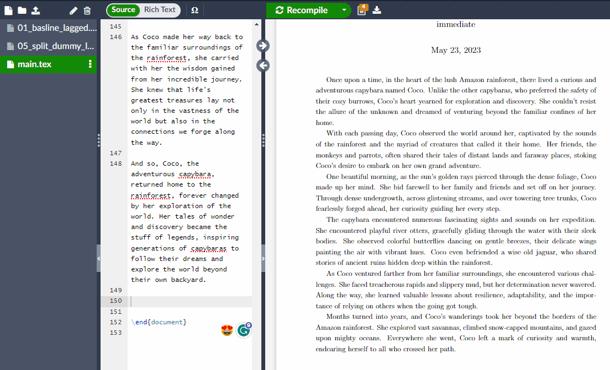
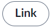
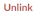
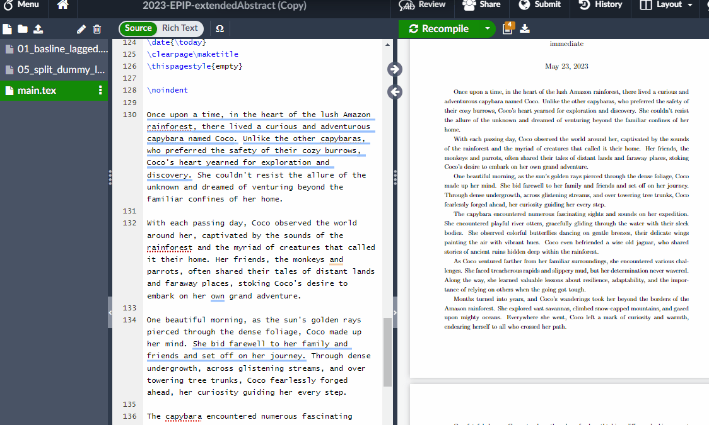
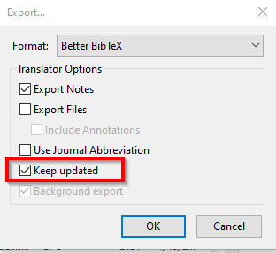
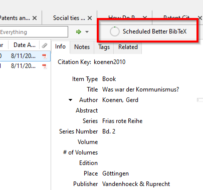

---
hide:
  - toc

title: 'Overleaf & Zotero'
---

## About Overleaf
Overleaf is an online collaborative writing and publishing platform designed specifically for researchers and academics who work on documents such as scientific papers, reports, and presentations. It provides a streamlined interface for creating, editing, and sharing documents in real-time with co-authors.

Overleaf makes using Latex and collaborations very convinient and easy, it is fast, robust and has a great documentation, but lacks customization compated to locally installed LaTeX editors Additionally, to setup Zotero integration and offline work requires additional setup and some technical knowledge - so let's do it step by step.

## Overleaf workflow
Before we start, some of the features need a premium subscription to Overleaf. Best check with your university/employer if they have a subscription with them. Overleaf is a great service and is definetly worth its money! I will, however, also describe how free Users can integrate Zotero in Overleaf.

## Zotero and Overleaf
You can decide between three different ways to use Zotero and Overleaf.

- [x] Manually upload the .bib file to Overleaf (free!)
- [x] Direct integration of Zotero (needs Overleaf premium)
- [X] Synch Zotero via Dropbox with Overleaf (needs Overleaf premium) [I use this approach]

=== "Manual Integration"
    The easiest, simplest and cost effcient (no Overleaf premium account needed) approach. Needs, however, a manual upload of the .bib file for every change in Zotero.
	
	[After creating and exporting the .bib file](working_overleaf), go to your Overleaf project, click on the Upload button and select (or drag-and-drop) the .bib file.
	
	
	
	Add the necessary Latex code and enjoy referencing.
	
=== "Direct Zotero Integration"
	If you have Overleaf Premium, you can make use of the build-in Zotero Integration. It is very simple to activate and use, and needs little manual input after the setup (the setup itself is also very simple). However, big Zotero databases might cause issues, because you will always need to import ALL your references. Additionally, you have little to no custimiation options.
	
	In Overleaf, go to 'Account -- Account Settings' and scroll down to 'Integrations -- Zotero Integration'. Link your Zotero Account by entering your credentials and granting Overleaf the necesary permissions. After sucessfully linking the account, the  should change to .
	
	Next, open a Overleaf project, create a 'New File' and select 'From Zotero'. Choose a name and format and 'Create' the file. Depending on the size of your database the creating of the .bib file can take a long time. After the process is finished, you will find a read-only .bib file in your project. From here, [you can continue as for any Latex project](working_overleaf). Keep in mind, that the Citation key might differ from the one in your local Zotero Database, if you use any plugins making changes to it.
	
	
	
	If you make changes in Zotero, you can select the .bib file in your Overleaf project and hit 'Refresh', which will re-import the file from Zotero.
	
	
=== "Zotero Integration via Dropbox"
	If you have Overleaf Premium, you can make use of the built-in Dropbox Integration. It is still relatively simple to setup, but needs some additional steps. After the intital setup, you will need to invest little manual work, while still keeping control over the customization. Keep in mind, that you need a Dropbox Account, its integration in your OS and that you rely on this 3rd party cloud service with your bibliographic and Latex data!

	In Overleaf, go to 'Account -- Account Settings' and scroll down to 'Integrations -- Project Synchronisation -- Dropbox'. Link your Zotero Account by entering your credentials and granting Overleaf the necesary permissions. After sucessfully linking the account, the  should change to .
	
	After successfully linking your Dropbox account with Overleaf, you should see an 'Apps' folder on the cloudservice (make sure to select the folder in your Dropbox selective sync settings, if it doesn't show up on your OS). Within the folder, in 'Overleaf', you can now find a folder for each of your Overleaf projects, including all files. Any changes you make (offline or online) will be uploaded to Dropbox once you are online and automatically synched with Overleaf.
	
	
	
	To keep your bibliography synched, we will make use of this Dropbox integration. We will follow the regular [approach when working with Latex](working_overleaf), but adjust the Translator Export options. First, if you didn't follow my Zotero setup, install the [excellent Addon-on 'Better BibTex for Zotero'](https://retorque.re/zotero-better-bibtex/) ([more info here](working_overleaf)). Next, right click on the folder containing the needed references and choose 'Export Collection...'. Pick the Format 'Better BibTex', decide on the Translator Options, but make sure to activate 'Keep updated' and confirm with OK. Lastly, choose the Dropbox folder on your computer containg your Overleaf project to save the .bib file.
	
	
	
	Whenever you add or remove literature to your project folder in Zotero, the .bib file on your computer will be updated (you will see a 'Scheduled Better BibTex' text in the right upper corner of Zotero.). The changed are uploaded to Dropbox and automatically synched with Overleaf. If you don't see the changes on Dropbox or in Overleaf, you can manually synchronize by clicking in your Overleaf project on the Overleaf symbol (left upper corner) , and choose 'Sync -- Dropbox'. However, this step should not be neccessary and smaller changes are normally synchronised within seconds.
	
	
	
Please also have a look at the [official Overleaf documentation](https://www.overleaf.com/learn/how-to/How_to_link_your_Overleaf_account_to_Mendeley_and_Zotero#Using_Zotero).
	