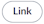

---
hide:
  - toc

title: 'Overleaf & Zotero'
---

## About Overleaf
Overleaf is an online platform that facilitates collaborative writing and publishing, tailoring to the specific needs of researchers and academics. This robust online service streamlines the process of creating, editing, and sharing a variety of Latex documents such as scientific papers, reports, and presentations, enabling real-time collaboration with co-authors.

Though Overleaf simplifies LaTeX usage and collaboration, and offers impressive speed and robust documentation, it lacks the customization features found in locally installed LaTeX editors. Additionally, setting up Zotero integration and enabling offline work demands some technical expertise and additional steps. Let's explore these processes in detail.

## Overleaf workflow
Before we begin, please note that certain features of Overleaf require a premium subscription. I recommend checking with your university or employer to see if they already have a subscription. For the benefit of free users, I'll also discuss integrating Zotero with Overleaf without a subscription.

## Zotero and Overleaf
You can decide between three different ways to use Zotero and Overleaf.

- [x] Manually upload the .bib file to Overleaf (Free!)
- [x] Direct integration of Zotero (Requires Overleaf premium)
- [X] Synchronize Zotero via Dropbox with Overleaf (Requires Overleaf premium) [This is my preferred approach]

=== "Manual Integration"
    This is the simplest, most cost-effective approach and it doesn't require an Overleaf premium account. However, each change in Zotero necessitates a manual upload of the .bib file.
	
	[After creating and exporting the .bib file](/working_overleaf), navigate to your Overleaf project, click on the 'Upload' button, and select (or drag-and-drop) the .bib file.

	

	Then, simply add the necessary LaTeX code and enjoy referencing.
	
=== "Direct Zotero Integration"
	If you have an Overleaf Premium account, you can take advantage of the built-in Zotero Integration. Although it's easy to activate and use with minimal manual input post-setup, bear in mind that large Zotero databases might create issues as the process imports ALL your references. Also, customization options are rather limited.

	In Overleaf, go to 'Account -- Account Settings' and scroll down to 'Integrations -- Zotero Integration'. To link your Zotero Account, enter your credentials and grant Overleaf the necessary permissions. Once your account is successfully linked, the  should change to .

	To create a new .bib file from Zotero, open an Overleaf project, select 'New File', and choose 'From Zotero'. Provide a name and format, then click 'Create'. Depending on your database size, generating the .bib file might take some time. Once completed, a read-only .bib file will appear in your project. From here, [you can continue as for any LaTeX project](/working_overleaf). Keep in mind that citation keys might differ from those in your local Zotero Database if you use any plugins that modify them locally.

	

	If you update Zotero, select the .bib file in your Overleaf project and hit 'Refresh' to re-import the file from Zotero.	
	
=== "Zotero Integration via Dropbox"
	If you have an Overleaf Premium account, you can use the built-in Dropbox Integration. Despite needing a few extra steps during setup, the process requires little manual work afterward, all while allowing you to maintain control over customization. Note that you'll need a Dropbox Account integrated into your OS and you're entrusting a third-party cloud service with your bibliographic and LaTeX data.

	In Overleaf, navigate to 'Account -- Account Settings' and scroll down to 'Integrations -- Project Synchronization -- Dropbox'. Link your Dropbox Account by entering your credentials and authorizing Overleaf to access the necessary permissions. Upon successful linkage, the  should change to .

	After linking your Dropbox account to Overleaf, an 'Apps' folder should appear on your cloud service (ensure you select this folder in your Dropbox selective sync settings if it doesn't automatically appear on your OS). Inside the 'Overleaf' folder, you'll find a separate folder for each of your Overleaf projects, which contains all relevant files. Any changes made (either offline or online) will be uploaded to Dropbox upon your next online session, and automatically synced with Overleaf (or the other way around).

	

	To maintain a synchronized bibliography, we'll utilize this Dropbox integration and follow the standard [procedure when working with LaTeX](/working_overleaf), but adjusting the Translator Export options accordingly. First, if you haven't already done so during your Zotero setup, install the [excellent Add-on 'Better BibTex for Zotero'](https://retorque.re/zotero-better-bibtex/) ([more info here](/working_overleaf)). Next, right-click on the folder containing the needed references and select 'Export Collection...'. Choose the 'Better BibTex' format, finalize the Translator Options, but ensure 'Keep updated' is activated before confirming with OK. Finally, save the .bib file into the Dropbox folder on your computer that contains your Overleaf project.

	

	Whenever you add or remove literature from your Zotero project folder, the .bib file on your computer updates automatically (you'll notice a 'Scheduled Better BibTex' text in the top-right corner of Zotero). The changes are uploaded to Dropbox and synced automatically with Overleaf. If changes don't appear on Dropbox or Overleaf, you can manually synchronize by clicking the Overleaf symbol (top-left corner)  in your Overleaf project and selecting 'Sync -- Dropbox'. However, this step should typically be unnecessary, as smaller changes usually sync within seconds.

	

	
For additional information, please consult the [official Overleaf documentation](https://www.overleaf.com/learn/how-to/How_to_link_your_Overleaf_account_to_Mendeley_and_Zotero#Using_Zotero).
	